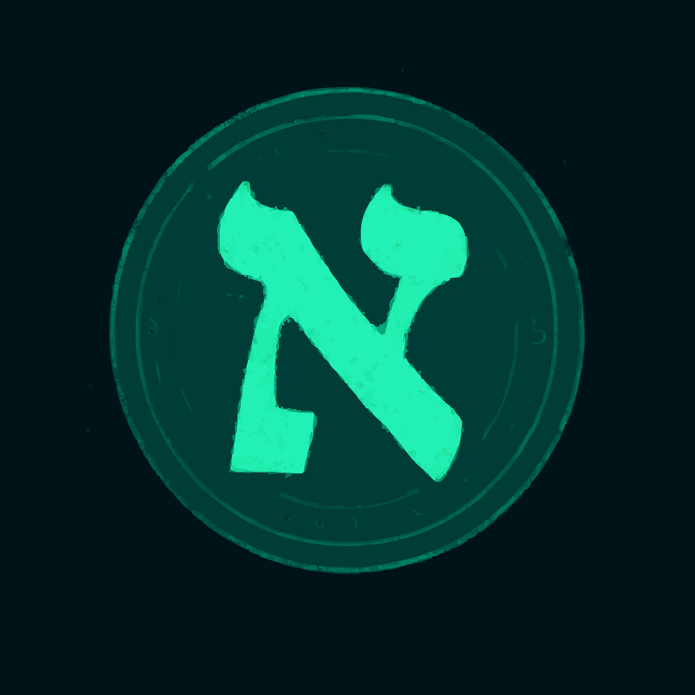

# Iam Ilia - Software Developer Portfolio

A modern, responsive portfolio built with **React**, **TypeScript**, and **Tailwind CSS**. Showcasing projects, skills, and experience as a software developer and tech enthusiast.



## Features

- Animated hero section with dynamic typing and animated background blobs
- GitHub integration: fetches user profile and recent repositories (with caching)
- Responsive design with dark mode (system and manual toggle)
- Language switcher (English & Persian) with RTL/LTR support
- Smooth navigation and animated section scrolling
- Stylish cards for skills, projects, and contact info
- Contact section with email, Telegram, Discord, and location
- Custom liquid-style transitions and effects
- Modern scrollbar, safe area insets, and accessibility improvements

## Tech Stack

- [React](https://react.dev/)
- [TypeScript](https://www.typescriptlang.org/)
- [Tailwind CSS](https://tailwindcss.com/)
- [Vite](https://vitejs.dev/)
- [Axios](https://axios-http.com/)
- [Tabler Icons](https://tabler.io/icons)
- [react-type-animation](https://www.npmjs.com/package/react-type-animation)

## Getting Started

### Prerequisites

- [Node.js](https://nodejs.org/) (v18+ recommended)
- [npm](https://www.npmjs.com/) or [bun](https://bun.sh/)

### Installation

```sh
git clone https://github.com/iamilia/my-react-app.git
cd my-react-app
npm install
# or
bun install
```

### Development

```sh
npm run dev
# or
bun run dev
```

Open [http://localhost:5173](http://localhost:5173) in your browser.

### Build

```sh
npm run build
```

### Lint & Format

```sh
npm run lint
npm run format
```

## Project Structure

```
src/
  components/    # UI components (Hero, About, Projects, etc.)
  hooks/         # Custom React hooks (useDarkMode, useLanguage)
  services/      # API services (GitHub)
  types/         # TypeScript types
  translations.tsx # i18n translations and hooks
  style.css      # Tailwind and custom styles
  App.tsx        # Main app component
  main.tsx       # Entry point
public/
  icon.svg       # App icon
  fonts/         # Custom fonts
```

## Configuration

- **GitHub Username:** Change the username in `src/services/githubService.ts` and `src/App.tsx` if you want to fetch data for a different user.
- **Contact Info:** Update links and addresses in `src/components/Hero.tsx` and `src/components/Contact.tsx`.
- **Skills & Projects:** Edit `src/components/Skills.tsx` and `src/components/Projects.tsx` to customize your stack and featured repositories.
- **Languages:** Update `src/translations.tsx` for i18n.

## Deployment

You can deploy this app to any static hosting (Vercel, Netlify, GitHub Pages, etc.) after building:

```sh
npm run build
```

Then serve the `dist/` folder.

## License

This project is open source and available under the [MIT License](LICENSE).

---

> Built with ❤️ by Ilia